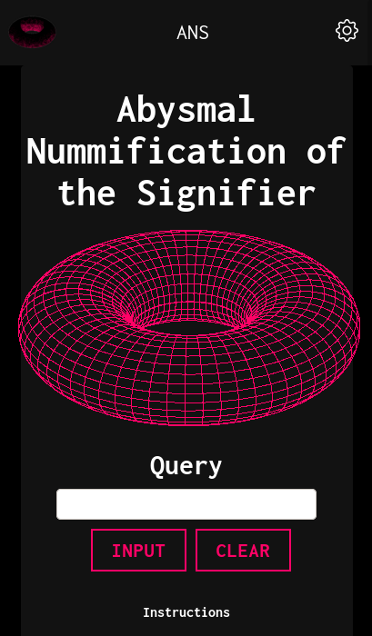

<div align="center">
  
</div>

# Nummifier

<p align="center">


</p>

<hr>

 A React.js web app to aid in anorganic numerological and lexical investigations. 

# Table of contents

- [Live Version](#liveversion)
- [Screenshots](#screenshots)
- [Installation](#installation)
- [Development](#development)
  - [Codebase](#codebase)
    - [Technologies](#technologies)
    - [Folder Structure](#folderstructure)
  - [Design Overview](#designoverview)
- [License](#license)

# Live Version
[(Back to top)](#table-of-contents)


# Screenshots
[(Back to top)](#table-of-contents)




# Installation
[(Back to top)](#table-of-contents)

Clone this repository, navigate into the project folder, and build the dependencies by executing:

```sh
git clone https://github.com/feydor/nummifier.git
cd nummifier
npm install
```

After installing the dependencies, start the development server by executing:

```sh
npm start
```

By default a development server will start at ``http://localhost:3001``. 

To develop, set the appropriate environment variables in .env:

```sh
DB_URI='mongodb+srv://<user>:<password>@cluster0.rn8t3.mongodb.net/Glossary?retryWrites=true&w=majority'
PORT='3001'
```

# Development
[(Back to top)](#table-of-contents)

## Codebase

### Technologies

Technologies used in this mono repo include:

- Full-stack JavaScript: Backend uses Node.js, Frontend uses React.js.
- ExpressJS: RESTful api
- MongoDB: NoSQL database
- React-Bootstrap: CSS and HTML framework
- create-react-app: Web application bundler and setup
- Prettier: JS code style formatter
- Jest: Testing framework

### Folder structure

```sh
nummifier/
├── client     # Front-end React.js app
│   ├── build               # Static build, served by server.js
│   ├── public              # HTML, favicons, etc
│   └── src                 # React components, containers, tests, numerological methods
│       ├── algorithims     # Gematria, Tic-Xenotation, digital reduction
│       ├── components      # Function components
│       ├── images          # gifs, resources
│       └── containers      # Stateful class container and entrypoint
├── db         # Database seeding functions
├── examples   # Screenshots and assorted images
├── models     # MongoDB schemas, models, and pre-hooks
└── server.js  # Back-end Express.js app
```

## Design Overview
[(Back to top)](#table-of-contents)


# License
[(Back to top)](#table-of-contents)

MIT, see the [LICENSE](./LICENSE) file.
